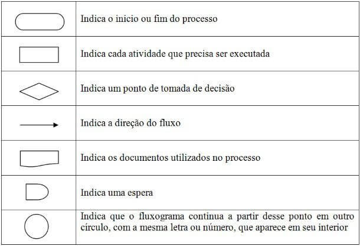

# Exercício 1
<h1>Introdução</h1>

Segundo o dicionário, um fluxograma é uma representação gráfica de um procedimento, problema ou sistema, cujas etapas ou módulos são ilustrados de forma encadeada por meio de símbolos geométricos interconectados. Existe uma forma certa de se ler um fluxograma para melhor entendimento das informações nele apresentadas.

Cada formato de seção signifca uma coisa, como explica a figura abaixo:

    

<i>Figura 1: Explicação para os diferentes formatos que uma seção pode ter em um fluxograma. Fonte: www.doutorgestão.com.br/como-elaborar-um-fluxograma/</i>

<h1>Sobre o projeto</h1>

Para o primeiro exercício, foi proposto a criação de um fluxograma que represente funçoes de inserção, remoção e pesquisa em uma lista linear. O fluxograma foi pensado com a intenção de fazer em um mesmo arquivo, uma representação de como funciona as funções em questão.

<h1>Como visualizar</h1>

Para visualizar o arquivo, basta seguir as instruções: 
<ul>
    <li>1º - Acessar a pasta 'fluxograma'.</li>
    <li>2º - Abrir o arquivo pelo navegador ou qualquer visualizador pdf.</li>
</ul>
