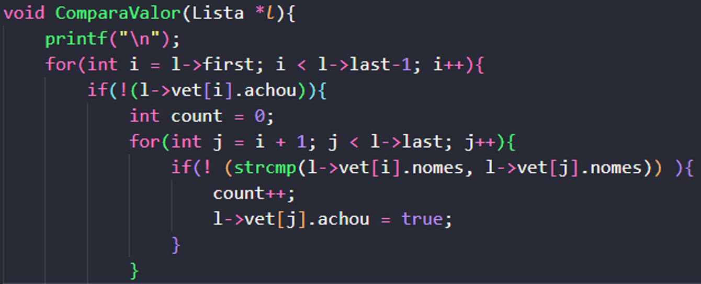

# Exercício 2
<h1>Introdução</h1>

Lista linear é uma estrutura de dados na qual os elementos de um <b>mesmo tipo de dados</b> estão organizados de maneira sequencial, obedecendo uma ordem lógica entre eles. Essa estrutura permite representar um conjunto de dados de forma a preservar a relação de ordem entre seus elementos (chamados de "nó").

<h1>Sobre o Projeto</h1>

Para o segundo exercício, foi proposta a criação de uma lista linear que conseguisse armazenar até 100 nomes quaisquer e 
uma função que, analisando nome por nome, conseguisse remover os que aparecessem mais de uma vez.

Essa remoção deveria ser feita sem mover os ponteiros da lista, logo, não pode-se usar o método "padrão" para remoção de elementos em listas lineares.

<h1>Lógica utilizada</h1>
<h2>Inserção dos nomes na lista linear</h2>

Os nomes que serão inseridos na lista, devem ser obtidos por meio da leitura em um arquivo de texto, por isso, <b>para que o programa fucione corretamente</b>, é necessário que, juntamente com os arquivos "README.md" e "Makefile", deva existir um arquivo <b>.TXT</b> com o nome de "nomes" e, cada nome presente no arquivo, deve ocupar apenas uma linha por vez, <b>NÃO FUNCIONANDO</b> quando o usuário escrever no formato: "Nome1, Nome2, etc...". Se preferir, pode-se utilizar um arquivo com um nome diferente para a leitura dos dados (contando que a regra da disposição dos nomes pelas linhas do arquivo de texto seja obedecida), porém, será necessário trocar na linha 15 do '<code>main.c</code>', o nome do arquivo desejado.

Os nomes são inserios na lista enquanto um laço '<code>while</code>', roda com o auxílio da função `fgets( )`, atribuindo cada linha do arquvio a uma variável do tipo char, e inserindo na lista essa variável. O laço while funcionará enquanto todas as linhas não tiverem sido verificadas, ou seja, enquanto a posição atual dentro do arquivo for diferente de NULL.

<b>Leitura e inserção dos nomes na lista:</b>

    

 <i>A linha vermelha mostra onde deve ser trocado o nome do arquivo, quando optar por um diferente de "nomes.txt"</i>

 

Após os nomes serem devidamente inseridos na lista, a função <b>TrocaCaractere( )</b> é chamada no main. Essa função tem como objetivo principal alterar o último caractere de cada uma das strings (vetores de chars) adicionadas, trocando o '\n' por '\0', evitando conflitos futuros durante as comparações. Essa função também verifica se a lista é válida, ou seja, se ela não está vazia e, certificando-se de que se trata de uma lista válida, aciona a próxima função, que irá realizar as comparações.

<h2>Comparando os nomes</h2>

No fim da função anterior, a função <b>ComparaValor( )</b> é acionada. Esta função recebe apenas a lista como parâmetro e tem como objetivo encontrar, contar e "esconder" os nomes repetidos presentes na lista. A função é iniciada com um for de 'i', que recebe como valor inicial o elemento que ocupa a primeira posição da lista e como valor final, o último elemento da lista - 1, fazendo assim com que percorra todas posições necessárias para comparação. A idéia principal do programa gira em torno da criação de uma variável 'booleana' que recebeu o nome de "achou", ela será responsável pela diferenciação dos nomes que repetiram na lista, ou não. Logo após o primeiro laço for, é criado um if que apenas permitirá a continuidade do programa quando a posição atual do "i" não contar com 'true' atribuído em sua variável "achou". Uma vez verificado que o valor da booleana para a atual posição do "i" se encontra em 'false', uma contador do tipo inteiro é criado, com o objetivo de contar quantas vezes um nome repetiu. Um segundo laço for é criado, este, recebe como valor inicial a próxima posição em relação ao "i" do for anterior e como valor final, o último elemento da lista, fazendo com que ele percorra toda a lista a partir de onde o "i" se encontra. Dentro do segundo for existe mais um if, esse sim será resposável pela comparação dos nomes presentes na lista. Com o auxílio da função <b>strcmp( )</b> oriunda da biblioteca '<code>string.h</code>', o conteúdo da posição "i" (que durante a primeira execução do programa se encontra 'travada' na posição inicial) é comparado com o conteúdo de todas as outras posições da lista, como exige o segundo for. Quando percebe-se que há uma igualdade entre as posições comparadas, é certo afirmar que houve uma repetição de um nome na lista. O contador então recebe um incremento "count++" e a posição na qual foi encontrada a igualdade (repetição), sofre uma atualização no valor da variável "achou" que passa a ser 'true', diferenciando-se assim, dos demais nomes, que por sua vez, permaneceram com 'false' atribuidos a sua variável "achou".

<b>Comparação dos nomes e troca do valor da variável booleana para cada elemento:</b>

    

<h2>Imprimindo lista atualiada</h2>

Como um dos desafios do exercício era sobre remover os nomes repetidos da lista sem alterar os ponteiros, a solução pensada foi aproveitar da variável "achou" criada e usada na comparação, para selecionar quais dos nomes iriam aparecer no printf e quais não iriam. Com essa lógica, foi criada a função <b>LImprimeNovaLista( )</b> que possui a mesma estrutura da já existente <b>LImprime( )</b>, porém, conta com um if que apenas mostrará aqueles nomes nos quais se mostraram não serem cópias de nomes anteriores. Essa verificação é feita a partir do valor da variável "achou" de cada posição.

<b>Mostrando nova lista, sem nomes repetidos:</b>

    

 
<h1>Perguntas sobre o exercício:</h1>
<b><h2> ★ Como você gerenciaria os espaçoes em branco para novas inserções?</h2></b>

Como citado na seção <i>Lógica utilizada</i>, o programa trata a "exclusão" dos nomes repetidos atribuindo um valor '<i>true</i>' para a a variável booleana 'achou' na posição atual. Para inserções futuras ocuparem estes espaços onde fora constatado que existia um nome repetido, seria criada uma nova função que, com o auxílio de uma estrutura for, percorreria toda a lista. Um if interno rodaria procurando as posições com valor = '<i>true</i>' e, encontrando, poderia ser feita a inserção de um novo nome aquela posição. Um segundo for então, percorreria novamente toda extensão da lista enquanto um if, verifica se o novo nome inserido já não consta em uma das posições. Certificando a validade do novo nome (não consta na lista), seria então adicionado a posição que antes constava com um espaço em branco, chamando a <b>LInsert( )</b>.
<b><h2> ★ Qual seria o custo dessas novas inserções?</h2></b>

O custo computacional envolvido com a nova função sugerida no tópico acima seria de 'O(n²)', pois conta com dois laços for. É importante dizer que, se preferir, o segundo for pode ser exlcuido, abaixando o custo computacional envolvido para 'O(n)', a exclusão do segundo laço apenas impedirá que a função verifique automáticamente, antes de inserir, se o novo nome já consta na lista.

 
<h1>Bibliotecas</h1>

Para o funcionamento do programa, é necessário incluir as seguintes bibliotecas: 
<ul>
    <li><code>#include 'stdlib.h'</code></li>
    <li><code>#include 'stdio.h'</code></li>
    <li><code>#include 'stdbool.h'</code></li>
    <li><code>#include 'string.h'</code></li>
</ul>

<h1>Compilação e execução</h1>

Para a correta execução do programa, temos as seguintes diretrizes de execução:

| Comando                |  Função                                                                                           |                     
| -----------------------| ------------------------------------------------------------------------------------------------- |
|  `make clean`          | Apaga a última compilação realizada contida na pasta build                                        |
|  `make`                | Executa a compilação do programa utilizando o gcc, e o resultado vai para a pasta build           |
|  `make run`            | Executa o programa da pasta build após a realização da compilação                                 |

