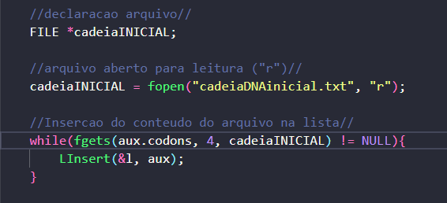
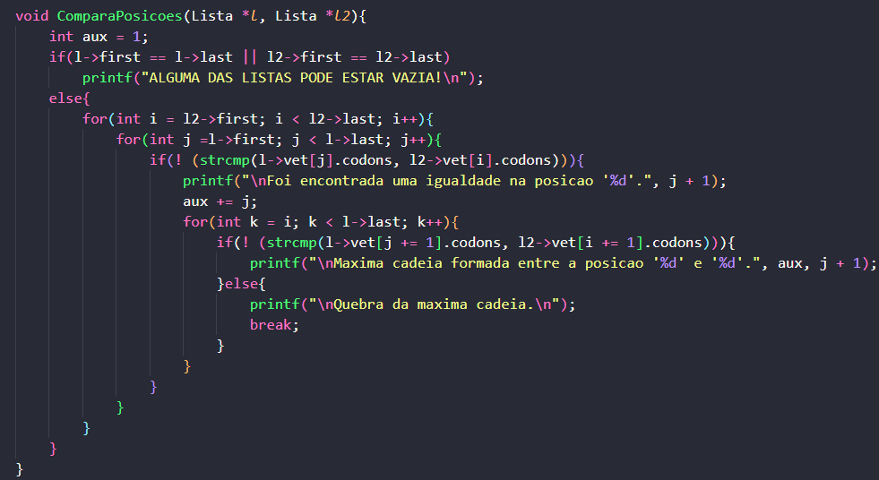

# Exercício 3
<h1>Introdução</h1>

Lista linear é uma estrutura de dados na qual os elementos de um <b>mesmo tipo de dados</b> estão organizados de maneira sequencial, obedecendo uma ordem lógica entre eles. Essa estrutura permite representar um conjunto de dados de forma a preservar a relação de ordem entre seus elementos (chamados de "nó").

O problema da máxima cadeia ou "<i>Max Length Chain problem</i>" diz respeito a um algoritmo que, ao receber um conjunto de 'n' elementos, normalmente pares numéricos, deve encontrar a cadeia mais longa que pode ser formada a partir de um determinado conjunto de pares.

<h1>Sobre o projeto</h1>

Para o terceiro exercício, foi proposto a criação de um programa que receba uma cadeia de DNA e armazene em uma lista. Cada posição da lista, deve conter um códon, ou seja, uma triade de nucleotídeos [<b>A, T, G, C</b>]. Feito isso, uma nova cadeia de DNA, menor, teria de ser lida e assimilada da mesma forma (inserido-a e separando cada posição por códons). O programa então, deveria identificar a maior cadeia referente a segunda lista criada, dentro da primeira.

<h1>Lógica utilizada</h1>
<h2>Leitura, separação e inserção das cadeias de DNA nas listas</h2>

As entradas de dados são obtidas atráves da leitura de um documento de texto, por conta disso, é de <b>extrema importância</b> a verificação dos nomes de tais arquivos. Para que o programa funcione corretamente, o usuário deve certificar-se de que:
<ul>
    

    <ol>1º - O arquivo que contém a <b>MAIOR</b> entrada de dados, deve ter o nome "<b>cadeiaDNAinicial.txt</b>".</ol>
    <ol>2º - O arquivo que contém a <b>MENOR</b> entrada de dados, deve ter o nome "<b>cadeiaDNApesquisa.txt</b>".</ol>
    <ol>3º - O texto dentro de cada documento deve ocupar apenas uma linha, não será reconhecido arquivos que contarem com quebras de linha.</ol>
    <ol>4º - Estes arquivos <b>NÃO</b> devem estar dentro da pasta "src", eles devem estar de fora, junto ao Readme e o Makefile.</ol>
    

</ul>
 

Uma estrutura 'while' irá rodar enquanto a posição atual dentro do arquivo for diferente de NULL. Dentro do while, a função `fgets( )` irá separar o corpo do texto em pedaços de tamanho '4' (o que representa o códon com 3 letras, ou seja, uma tríade de nucleotídeos) em cada posição da lista. O mesmo procedimento é usado para a inserção e criação da segunda lista. Após isso, teremos duas listas ("l" e "l2") contando, respectivamente, a cadeia maior de DNA e a menor.

<b>Exemplo: leitura, separação e inserção da cadeia de DNA maior na listas:</b> 

    

<h2>Procurando códons compatíveis</h2>

Para fazer a verificação de cada posição de uma lista enquanto a compara com outra, visando encontrar os códons compatíveis, foi criada uma função <b>ComparaPosicoes( )</b> que recebe ambas as listas como parâmetro. Dentro da função, a primeira verificação que ocorre é se existe alguma lista vazia entre as duas que serão comparadas, caso exista, o programa encerra. Garantindo que não há nenhuma lista vazia, as comparações começam.
A lógica do programa funciona rodando 3 loops de for. O primeiro deles, irá receber como valor inicial o primeiro elemento da lista menor e como valor limite, o último elemento da mesma. Esse for tem como objetivo travar a lista menor na mesma posição enquanto os outros loops caminham. O segundo for vem logo em seguida, recebe como valor inicial o primeiro elemento da lista maior e como valor limite, o último da mesma. Sua função é rodar o if, na qual será feita a comparação entre as posições atuais do [ i ] e do [ j ]. Dentro do if, a função <b>strcmp( )</b>, oriunda da biblioteca '<code>string.h</code>' irá comparar as posições atuais em que cada variável se encontra, da seguinte forma: <code>(!(strcmp(l->vet[j].codons, l2->vet[i].codons)))</code>. Quando duas posições comparadas forem iguais, o programa deve printar para o usuário que encontrou uma igualdade e informar em qual posição da lista ela ocorreu. Ao encontrar um par de códons compatíveis, uma variável do tipo 'int' de nome "aux" que teve seu valor inicial igual a 1, recebe [ j ], para armazenar a posição na qual foi encontrada a compatibilidade. Uma vez encontrado o primeiro par de códons compatíveis, um terceiro for é incrementado com o objetivo de verificar as próximas posições das listas. Dentro dele, um outro if aparece fazendo a mesma comparação, porém, pegando posições futuras ( [ j += 1 ], [ i += 1 ] ). Caso haja uma confirmação de que a(s) próxima(s) posição de ambas as listas também é compatível, o programa printa novamente para o usuário e informa que foi encontrada a máxima cadeia da posição X até a posição Y. Caso contrário, se o programa verificar e concluir que a(s) próxima(s) posição de ambas as listas não são iguais, o programa printa para o usuário que a máxima cadeia foi quebrada e encerra o loop.

<b>Busca por códons compatíveis e comparação:</b>

    

 
<h1>Bibliotecas</h1>

Para o funcionamento do programa, é necessário incluir as seguintes bibliotecas: 
<ul>
    <li><code>#include 'stdlib.h'</code></li>
    <li><code>#include 'stdio.h'</code></li>
    <li><code>#include 'stdbool.h'</code></li>
    <li><code>#include 'string.h'</code></li>
</ul>

<h1>Compilação e execução</h1>

Para a correta execução do programa, temos as seguintes diretrizes de execução:

| Comando                |  Função                                                                                           |                     
| -----------------------| ------------------------------------------------------------------------------------------------- |
|  `make clean`          | Apaga a última compilação realizada contida na pasta build                                        |
|  `make`                | Executa a compilação do programa utilizando o gcc, e o resultado vai para a pasta build           |
|  `make run`            | Executa o programa da pasta build após a realização da compilação                                 |

