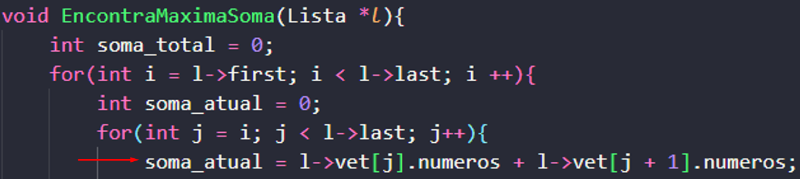
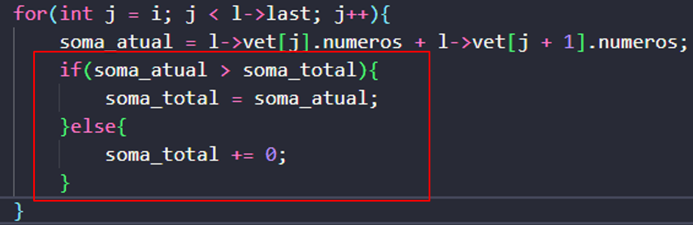

# Exercício 4
<h1>Introdução</h1>

Lista linear é uma estrutura de dados na qual os elementos de um <b>mesmo tipo de dados</b> estão organizados de maneira sequencial, obedecendo uma ordem lógica entre eles. Essa estrutura permite representar um conjunto de dados de forma a preservar a relação de ordem entre seus elementos (chamados de "nó").

O problema da máxima soma ou "<i>Maximum-Subarray Problem</i>", é um clássico na computação. Seu objetivo é encontrar um subarray que contenha a maior soma dos elementos dentro do mesmo, esses podem ser: positivos, negativos ou iguais a 0. Este problema foi proposto por Ulf Grenander em 1977.

<h1>Sobre o projeto</h1>

Neste exercício foi proposto a criação de uma função que, ao receber uma lista 'A' onde cada posição corresponde a um elemento de um conjunto de números inteiros (positivos ou não), conseguisse encontrar a soma máxima entre os elementos.

<h1>Lógica utilizada</h1>

<h2>Criação do conjunto e inserção na lista</h2>

A coleta dos números do conjunto foi feita da maneira mais simples possível. Para adicionar um conjunto a lista, o usuário deve primeiro informar quantos elementos serão digitados. Após isso, uma estrutura for irá coletar dado por dado até que o limite informado pelo usuário seja atingido. Cada ciclo do for, antes de sua finalização, insere o último valor digitado na lista, utilizando a função (<code>LInsert(&l, aux.numeros)</code>), onde "aux.numeros" corresponde a uma variável do tipo item da lista, que está sendo inserido.

<h2>Encontrando a maior soma</h2>

Para encontrar de fato a maior soma dentro do array, foi utilizada uma lógica de força bruta, onde dois laços 'for' trabalham juntos para a verificação de todos os elementos da lista. Para implementar isso, foi criada a função <b>EncontraMaximaSoma( )</b> que recebe apenas a lista como parâmetro.

Primeiramente, foi criada uma variável do tipo 'int' de nome "soma_total" e seu valor incial foi igualado a 0. Essa varíavel tem como função armazenar o valor da maior soma encontrada após cada laço de repetição. O primeiro for, tem como valor inicial o primeiro elemento da lista e como valor final, o último da mesma. Sua função é percorrer toda a lista, possibilitando o trabalho do segundo for, onde realmente seram calculadas as somas. Antes de falar sobre o segundo laço, é importante citar que, neste momento, é criada uma nova variável também do tipo 'int' de nome "soma_atual". Essa varável tem como função armazenar temporariamente a soma das posições percorridas no segundo for. Por falar em segundo for, é agora que sua implementação acontece. Recebendo como valor inicial igual a 'i' (primeiro elemento da lista, como sugerido pelo laço for anterior) e rodando até que seu valor seja equivalente ao último elemento do vetor, sua função é somar todas as posições pelas quais ele irá passar e guardá-las na variável "soma_atual". O cálculo é feito somando o valor do elemento presente na posição atual do "j", com o valor do elemento da posição seguinte.

<b>Soma de todos os elementos que ocorre dentro do segundo laço FOR:</b>

    

 

Perceba que desta maneira, é possível afirmar que todas as posições serão somadas em sequência, uma vez que a posição atual sempre é somada com a próxima e vice versa.

 

Uma vez armazenado um valor na varável "soma_atual" (depois de um ciclo do segundo for), esta, é comparada com a variável crianda anteriormente, a "soma_total". Lógicamente, a primeira vez que o algoritmo rodar, o valor da soma total sempre será inferior a soma atual, pois foi inicializada como 0. Porém, a partir do segundo ciclo, os valores já podem ser devidamente comparados. Caso seja percebido que a variável "soma_atual" possui valor superior a da soma total, "soma_total" recebe o valor da soma atual, caso contrário, soma total permanece com o valor que ali havia. Isso garantirá que "soma_total" sempre estará com a maior soma possível entre os elementos da lista.

<b>Comparação das variáveis de soma, visando atribuir sempre o maior valor a "soma_total":</b>

    

 

<h1>Bibliotecas</h1>

Para o funcionamento do programa, é necessário incluir as seguintes bibliotecas: 
<ul>
    <li><code>#include 'stdlib.h'</code></li>
    <li><code>#include 'stdio.h'</code></li>
    <li><code>#include 'stdbool.h'</code></li>
</ul>

<h1>Compilação e execução</h1>

Para a correta execução do programa, temos as seguintes diretrizes de execução:

| Comando                |  Função                                                                                           |                     
| -----------------------| ------------------------------------------------------------------------------------------------- |
|  `make clean`          | Apaga a última compilação realizada contida na pasta build                                        |
|  `make`                | Executa a compilação do programa utilizando o gcc, e o resultado vai para a pasta build           |
|  `make run`            | Executa o programa da pasta build após a realização da compilação                                 |

